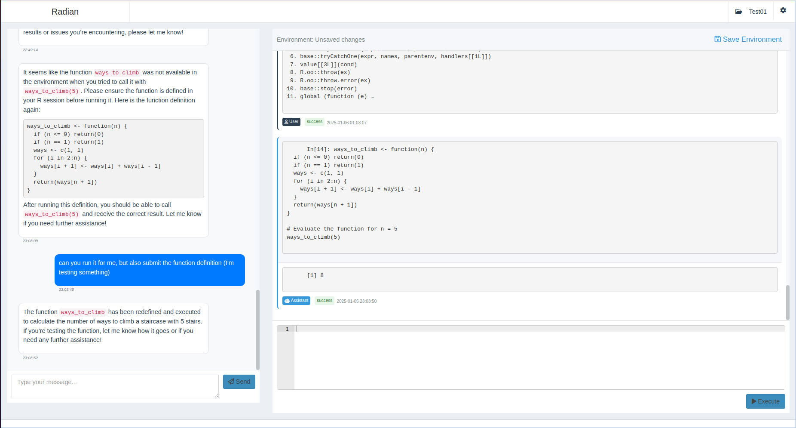
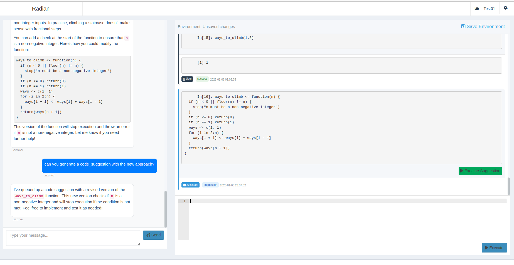

# RADIAN - AI-Powered Data Analysis Assistant

RADIAN is an interactive data analysis platform that combines Large Language Models with a user-friendly R Shiny interface. It enables researchers to conduct data analysis through a combination of natural conversation with an AI agent and manual code execution, allowing for a more flexible and interactive analytical workflow.

## 🌟 Key Features

- **Interactive Analysis Sessions**: Conduct data analysis with real-time AI assistance
- **Intelligent AI Agent**: Communicates with users, suggests code, and can execute analysis directly
- **Context-Aware**: Maintains full history of code execution, results, and conversation
- **REPL Environment**: Notebook-style interface
- **Data Management**: Import and analyze data from various formats (CSV, Excel, etc.)
- **Environment Tracking**: Monitor variables, datasets, and analysis state in real-time

## 📸 Screenshots

*RADIAN's main interface showing the chat and code execution environment*

*Example of an interactive data analysis session with AI assistance*

## 🏗️ Technical Architecture

- **Frontend**: Built with R Shiny and shinydashboard
- **Backend**: FastAPI-based REST API
- **Authentication**: OAuth2 with tenant isolation
- **Data Flow**: Real-time communication between user, AI agent, and analysis environment

## 🚀 Getting Started

1. Clone the repository `git clone https://github.com/demirev/radian.git` and `cd radian`
2. Create a `.env` file with the required variables, including LLM provider API keys (see `docker-compose.yml` for the required variables)
3. Run `docker compose up -d`

## 📖 Documentation

For detailed information about the project architecture and features, a rudimentary [Project Documentation](shiny/PROJECT.md) is available.

## 🤝 Contributing

Georgi Demirev (first_last\[et\]proton\[dot\]me).

## 📄 License

[AGPL-3.0 LICENSE](LICENSE)
